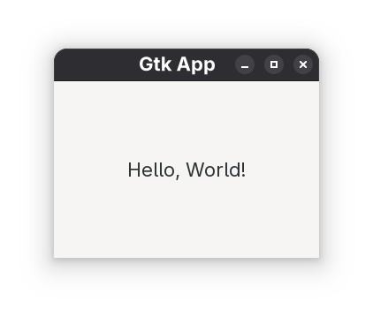

# Using Flex/Bison and Console/GUI with C on Arch Linux

Update the system:
```
sudo pacman -Syu
```

Install the necessary packages (if you don't have them):
```
sudo pacman -S base-devel flex bison gtk3 gdb
```

## Using console

Write a lexer file like this: 
[figure-4-58/lexer.l](figure-4-58/lexer.l)

Write a parser file like this
[figure-4-58/parser.y](figure-4-58/parser.y)

Write a main file like this:
[figure-4-58/main.c](figure-4-58/main.c)

Compile the three files and run the output:
```
bison -d parser.y
flex lexer.l
gcc -o run parser.tab.c lex.yy.c main.c -lfl
./run
```

Or create a Bash Script like this:
[figure-4-58/run.sh](figure-4-58/run.sh)

The output of the interpreter will look like this:


## Using GUI with Gtk3

Write the main GUI file like this:
[app/app.c](app/app.c)

Compile and run the application:
```
gcc app.c -o app $(pkg-config --cflags --libs gtk+-3.0)
./app
```

The application will look like this:



